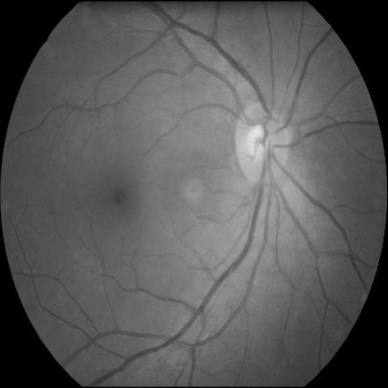
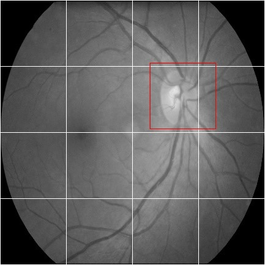
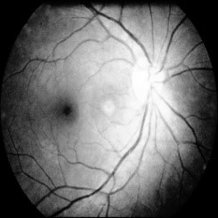

# 基于遗传算法特征加权的支持向量机在白内障眼底图片分类方面的应用

## 主要步骤
* **[图像分割](#1)**

* **[特征提取](#2)**

* **[对特征用遗传算法进行加权](#3)**

* **[用SVM对特征进行分类](#4)**

* **[代码运行方式](#5)**

## 
1、 图像分割

[preProcess.py][8]
将原图像均匀地分成 **4 * 4** 的 **16**份子图像，又由于视神经盘是判断白内障的一个重要依据，所以在图像分块的同时，将含有视神经盘的子图像单独取出，这样原图像就被分割成了 **17** 份子图像(图中红色方框圈出来的区域就是重复采样的视神经盘的部分)，然后依次对着 **17** 份子图像进行特征提取。

	
	

	# split images into small images
	'''
		parameter:
			img:array of a image
	
		return:
			a array list of splited images 
	'''
	def splitImg(img):
		split_imgs = list()				# 创建一个列表，用来存放分割完成的子图像
		# img = cv2.imread(img_path, 0)
		# print type(img)
		split_imgs.append(img[:512, 512:1024])
		split_imgs.append(img[:512, 1024:1536])
		split_imgs.append(img[512:1024, 0:512])
		split_imgs.append(img[512:1024, 512:1024])
		split_imgs.append(img[512:1024, 1024:1536])
		split_imgs.append(img[512:1024, 1536:2048])
		split_imgs.append(img[1024:1536, 0:512])
		split_imgs.append(img[1024:1536, 512:1024])
		split_imgs.append(img[1024:1536, 1024:1536])
		split_imgs.append(img[1024:1536, 1536:2048])
		split_imgs.append(img[1536:2048, 512:1024])
		split_imgs.append(img[1536:2048, 1024:1536])
		return split_imgs
这段代码描述的是将图像分割成**4 * 4**的小块图像。

## 
2、 特征提取

在完成了第一步图像分割之后，我们得到 **17** 子图像，这时需要对这**17**块子图像依次进行特征提取，提取的特征有：

- **[颜色特征](#A)**
- **[纹理特征](#B)**
- **[小波特征](#C)**

### 
2.1 颜色特征

[extractColorFeature.py][9]由于我们的原始图像就是灰度图，不是彩色图，这样就不能分别提取RGB分量来做颜色特征的计算，所以这里我们采用[直方图均衡化][1]之后的图像来进行图像颜色特征的计算。在实现中，我们直接利用 **python + opencv** 来完成对图像进行直方图均衡化的工作。直方图均衡化之后的图像如图所示(下图中左图为均衡化之前的图像，右图为均衡化之后的图像)，由图中可以看出，均衡化之后图像的对比度增强了，这样会更容易区分图像所属的类别。

	
	

	res = cv2.equalizeHist(img)
上面的这一行代码即可调用opencv的equalizeHist来完成对图像的均衡化操作，**img**为原始图像，**res**为均衡化之后的图像。

	histr = cv2.calcHist([split_img], [0], None, [32], [0, 256])	
	# 将原图像的256个灰度级减少到32个灰度级，减少计算量，节省时间
	histr = histr.flatten()				# 将矩阵转换为一维矩阵
	hist = histr / sum(histr)			# 计算每个灰度值出现的频率
	split_hist_list.extend(hist)		# 将hist存储在一个列表中，便于之后提取计算

上面这几行代码就是在计算图像的灰度值，首先将图像的灰度级从256级降低为32个灰度级，这样可以很大程度上降低计算量，然后再计算每个灰度值出现的频率，将每个灰度值出现频率保存为图像的灰度特征，最后将颜色特征保存在一个**pkl**文件中，方便程序的读取。

	# 将图像的颜色特征保存为.pkl文件
	pickle.dump(histograms, open(fea_dir +'color_feature.pkl', 'wb'))

### 
2.2 纹理特征

[extractGLCMFeature.py][10]纹理特征，我们选用的是[灰度共生矩阵GLCM][2]，算法实现是参照[这里][3]，源码为**C++**编写，这里我们自己改成了**python**编写的。由于原始图像是256个灰度级，这样每个灰度共生矩阵就是**256 * 256**的维度，计算量大，所以我们这里先对灰度级进行降级操作，将灰度级别从**256**级降为**16**级，这样灰度共生矩阵就降为**16 * 16**的维度，减少计算量。
	
	# 对图像的灰度值进行降维，为了简化之后的灰度共生矩阵的计算	23.4s
	def decDim(src_array):									# 引用传值
		print "decDim..."
		for i in range(src_array.shape[0]):					# 遍历行数
			# print 'the %dth line' % i
			for j in range(src_array.shape[1]):				# 遍历列数
				src_array[i][j] = src_array[i][j] / 16
然后对灰度降级完成的图像进行灰度共生矩阵的计算：

	# 计算水平方向上的灰度共生矩阵
	def calcHorisonGLCM(img):
		print 'calculate horison GLAM...'
		dst_mat = initMat()						# 初始化灰度共生矩阵
		height, width = img.shape				# 获取输入图像的尺寸
		# 遍历图像中每个像素点的像素值
		for i in range(height):					# 行遍历
			for j in range(width - 1):			# 列遍历(此处注意下标越界错误)
				# print 'the %dth row, the %dth col' % (i, j)
				row_pixel = img[i][j]			# 获取原图像的像素值 
				col_pixel = img[i][j + 1]
				# 根据像素值在灰度共生矩阵上进行标注
				dst_mat[row_pixel][col_pixel] += 1	
		return dst_mat

灰度共生矩阵一共分为四个方向，上述代码描述的计算水平方向的灰度共生矩阵。灰度共生矩阵计算完成后将计算结果以一个二维矩阵的形式返回，接下来计算每个灰度共生矩阵的四个描述灰度共生矩阵特征的值，分别为：**能量，对比度，逆差矩和熵**
	
	# 灰度共生矩阵的能量计算
	GLCM_energy += np.square(src_mat[i][j])
	# 灰度共生矩阵的对比度计算		
	GLCM_contrast += np.square(i - j) * src_mat[i][j]
	# 灰度共生矩阵的逆差矩计算			
	GLCM_idMoment += src_mat[i][j] / (1 + np.square(i - j))	
	# 灰度共生矩阵的熵的计算
	# 计算灰度共生矩阵熵的时候，因为式子中需要计算log，所有需要对矩阵中元素是否大于0进行判断
	if (src_mat[i][j] > 0):
		GLCM_entropy -= src_mat[i][j] * math.log(src_mat[i][j])	
需要分别对四个方向的灰度共生矩阵都计算四个特征描述值。同样每个方向的特征值计算完成之后，保存在**pkl**文件中。
	
	pickle.dump(GLCM_feature, open(fea_dir + 'GLCM_feature.pkl', 'wb'))

### 
2.3 小波特征

[extractWaveFeature.py][11]小波变换，我们并没有完成变换基本的算法实现，而是调用的第三方库[pywt][4]来完成小波变换以及小波系数的提取，这里我们提取的是**第二、三层小波变换的水平、垂直和对角线方向上的小波系数**。

	# 提取图像的三层小波分解系数
	def getWaveCoe(img):						# 参数：图像
		feature_list = []						# 创建一个列表，用来存放小波系数频数
		# 对灰度图像进行小波三层小波分解
		# 选用haar小波基
		# 返回值为一个list，每一层的高频都是包含在一个tuple中
		# 例如三层的话返回为 [cA3, (cH3, cV3, cD3), (cH2, cV2, cD2)， (cH1, cV1, cD1)]
		# 其中cA3为第三层小波分解的低频系数
		img_wave_result = pywt.wavedec2(img, 'haar', level = 3)				
	
		# 对三层小波分解后的系数进行分析
		l3 = img_wave_result[0]							# 第三次小波分解的低频部分
		h3 = img_wave_result[1]							# 第三次小波分解的高频部分，为一个tuple
		h3_h = h3[0]; h3_v = h3[1]; h3_d = h3[2]		# 将高频部分分别拆分为水平，垂直以及对角线三个方向
		h2 = img_wave_result[2]							# 第二次小波分解的高频部分，tuple
		h2_h = h2[0]; h2_v = h2[1]; h2_d = h2[2]
		# 由于维数较大，计算比较复杂，被舍弃
		# h1 = img_wave_result[3]						# 第一次小波分解的高频部分，tuple
		# h1_h = h1[0]; h1_v = h1[1]; h1_d = h1[2]

由于提取出来的二、三层小波的系数浮动范围较大，所以对提取的小波系数进行降维(归一化处理)，减小特征矩阵的维度，从而降低计算量。

	# 对小波系数进行归一化处理，划分成十个等级-450 ~ 450
	def getWaveFreq(wave_mat):
		wave_freq = [0, 0, 0, 0, 0, 0, 0, 0, 0, 0]		# 定义一个1 * 10的全零list
		height, width = wave_mat.shape					# 获取输入矩阵的行数和列数
	
		# 根据指定的范围对小波系数进行归一化处理
		for i in range(height):							# 行遍历
			for j in range(width):						# 列遍历
				if(wave_mat[i][j] >= -450 and wave_mat[i][j] < -360):
					wave_freq[0] += 1
				elif(wave_mat[i][j] >= -360 and wave_mat[i][j] < -270):
					wave_freq[1] += 1
				elif(wave_mat[i][j] >= -270 and wave_mat[i][j] < -180):
					wave_freq[2] += 1
				elif(wave_mat[i][j] >= -180 and wave_mat[i][j] < -90):
					wave_freq[3] += 1
				elif(wave_mat[i][j] >= -90 and wave_mat[i][j] < 0):
					wave_freq[4] += 1
				elif(wave_mat[i][j] >= 0 and wave_mat[i][j] < 90):
					wave_freq[5] += 1
				elif(wave_mat[i][j] >= 90 and wave_mat[i][j] < 180):
					wave_freq[6] += 1
				elif(wave_mat[i][j] >= 180 and wave_mat[i][j] < 270):
					wave_freq[7] += 1
				elif(wave_mat[i][j] >= 270 and wave_mat[i][j] < 360):
					wave_freq[8] += 1
				elif(wave_mat[i][j] >= 360 and wave_mat[i][j] < 450):
					wave_freq[9] += 1
		print 'wave_freq', wave_freq
		return wave_freq 								# 将频数矩阵返回

小波系数提取完成之后，同样需要保存在**pkl**文件中：
	
	
	pickle.dump(wave_feature, open(fea_dir + 'wave_feature.pkl', 'wb'))	

## 
3、 对特征用遗传算法进行加权

[GAImplement_improved.py][12][遗传算法][5]，是一种通过模拟自然进化过程搜索最优解的方法。在这里，我们利用遗传算法来寻找特征之间的最有权值，以使得最后预测准确度达到最佳。

	color_normal_list = [x * weight[0] for x in color_normal_list]
	GLCM_normal_list = [x * weight[1] for x in GLCM_normal_list]
	wave_normal_list = [x * weight[2] for x in wave_normal_list]
在遗传算法寻找最有权值的过程中，将遗传算法生成的三个权值分别乘以三个特征向量，最后组合成一个整体的特征向量，接着将生成的加权特征向量送入SVM分类器进行分类。此处，遗传算法的适应度函数，我们选用的是分类的准确度。

	# calcuate fitness
	def fitness(color_feature, GLCM_feature, wave_feature, color, GLCM, wave, index):	
		log_file = open('Accuracy.log', 'a')
		decoding()							# 解码
		del Accuracy[:]						# 清空列表中的元素，需要进行解码了之后再清空列表
		for i in range(len(resultList)):		# 50
			print '************', index, '####', (i + 1), '***************'
			svmTrainGetWeight.generateData_4(color_feature, GLCM_feature, wave_feature, resultList[i])
			print 'data training...'
			svmTrainGetWeight.svmTrain_4()
			'''
				testing...
			'''
			print 'testing...'
			svmDataPreProcess.generateData(color, GLCM, wave, resultList[i])
			y, x = svm_read_problem('05-17/test_data/test_data')
			model = svm_load_model('05-17/train_data/model_weight')
			p_label, p_acc, p_val = svm_predict(y, x, model)
			# 将tuple p_acc的第一个元素(准确率)添加到Accuracy列表中
			Accuracy.append(p_acc[0])		
			log_text = str(resultList[i][0]) + '\t' + str(resultList[i][1]) + '\t' + \
					   str(resultList[i][2]) + '\t' + str(p_acc) + '\n'
			log_file.write(log_text)
			log_file.flush()					# 清理缓存，将缓存区的数据及时写入文件
		log_file.close()

## 
4、 SVM 支持向量机分类器

[SVM][6]，通俗来讲，它是一种二类分类模型，其基本模型定义为特征空间上的间隔最大的线性分类器，其学习策略便是间隔最大化，最终可转化为一个凸二次规划问题的求解。这里我们直接调用[libsvm][7]第三方库来完成SVM分类器的实现。

## 
5、 代码运行方式

### 5.1 训练阶段
项目根目录下**./ImageProcess/**运行：
	
	python main_extractFeature.py
这句命令执行完成之后，提取所有训练图像的特征，并且按照特征类别分别存储在pkl文件中。
	
	python main_extractPredictFeatures.py

这句命令执行完成之后，提取所有测试图像的特征，并且按照特征类别分别存储在pkl文件中。
	
切换目录到**./ImageProcess/normalization/**文件夹下，运行：
	
	python GAImplement_improved.py

这句命令的执行，就是通过遗传算法来获取最优的权值，这部分包含用[libsvm][7]来完成参数的训练，模型的保存以及模型的加载问题。

最后，可以用最优的权值和三个特征分别相乘，来获得最优的分类准确度(这一步笔者没有附上代码，需要读者自行完成)。

[1]: https://www.cnblogs.com/tianyalu/p/5687782.html "直方图均衡化"
[2]: http://blog.csdn.net/jiandanjinxin/article/details/51329109 "GLCM"
[3]: http://blog.csdn.net/lingtianyulong/article/details/53032034 "C++源码"
[4]: https://github.com/NewCoderQ/pywt "pywt"
[5]: https://mp.weixin.qq.com/s?__biz=MzA3MzI4MjgzMw==&mid=2650729598&idx=1&sn=7d68cc7a009d616545d7afd983ee9c63&chksm=871b2800b06ca116eaf8236cdeb8a3e56c1169a8629b9a72a363121a695d45a7c2c06cbddecf&mpshare=1&scene=1&srcid=080563cfVbTyTFny4mJNSUdE#rd "遗传算法"
[6]: http://www.dataguru.cn/thread-371987-1-1.html "Support Vector Machine"
[7]: https://github.com/cjlin1/libsvm "libsvm"
[8]: https://github.com/NewCoderQ/CataractClassification/blob/master/src-code/preProcess.py "preProcess.py"
[9]: https://github.com/NewCoderQ/CataractClassification/blob/master/src-code/extractColorFeature.py "extractColorFeature.py"
[10]: https://github.com/NewCoderQ/CataractClassification/blob/master/src-code/extractGLCMFeature.py "extractGLCMFeature.py"
[11]: https://github.com/NewCoderQ/CataractClassification/blob/master/src-code/extractWaveFeature.py "extractWaveFeature.py"
https://github.com/NewCoderQ/CataractClassification/blob/master/src-code/normalization/GAImplement_improved.py "GAImplement_improved.py" 